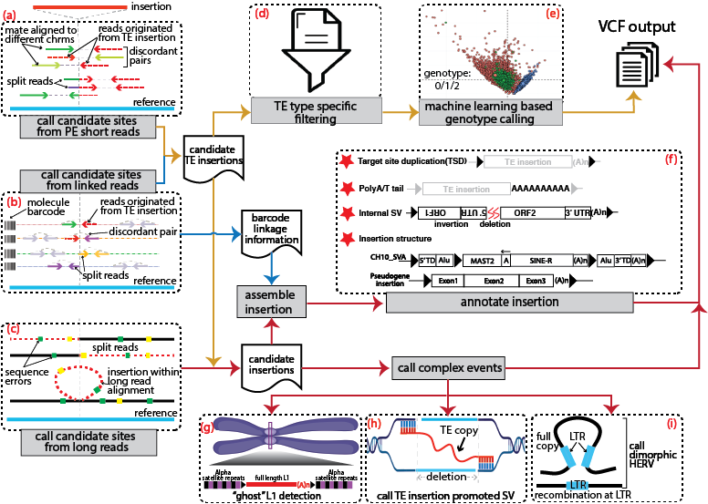

## xTea

xTea (comprehensive transposable element analyzer) is designed to identify TE insertions from paired-end Illumina reads, barcode linked-reads, long reads (PacBio or Nanopore), or hybrid data from different sequencing platforms and takes whole-exome sequencing (WES) or whole-genome sequencing (WGS) data as input. 




## Download

1. short reads (Illumina and Linked-Reads)

	+ 1.1 latest version

	```
	git clone https://github.com/parklab/xTea.git
	```

	+ 1.2 cloud binary version

	```
	git clone --single-branch --branch release_xTea_cloud_1.0.0-beta  https://github.com/parklab/xTea.git
	```

2. long reads (PacBio or Nanopore)

	```
	git clone --single-branch --branch xTea_long_release_v0.1.0 https://github.com/parklab/xTea.git
	```
3. pre-processed repeat library used by xTea (this library is used for both short and long reads)  
	
	```
	wget https://github.com/parklab/xTea/raw/master/rep_lib_annotation.tar.gz
	```
	
4. gene annotation files are downloaded from GENCODE. Decompressed gff3 files are required.
	+ For GRCh38 (or hg38), gff3 files are downloaded and decompressed from https://www.gencodegenes.org/human/release_33.html ;
	+ For GRCh37 (or hg19), gff3 files are downloaded and decompressed from https://www.gencodegenes.org/human/release_33lift37.html ;
	+ For CHM13v2, gff3 files are downloaded from https://s3-us-west-2.amazonaws.com/human-pangenomics/T2T/CHM13/assemblies/annotation/chm13.draft_v2.0.gene_annotation.gff3;
	+ Or use the latest version

## Dependencies

1. bwa (version **0.7.17** or later, which requires the **-o** option), which can be downloaded from https://github.com/lh3/bwa.
2. samtools (version 1.0 or later), which can be downloaded from https://github.com/samtools.
3. minimap2 (for long reads only), which can be downloaded from https://github.com/lh3/minimap2.
4. wtdbg2 (for long reads only), which can be downloaded from https://github.com/ruanjue/wtdbg2.
5. Python 2.7+/3.6+
	+ For the following packages, only a conda-based installation in shown. You may also install these in other ways, such as pip. 
	+ pysam (https://github.com/pysam-developers/pysam, version 0.12 or later) is required.
		+ Install pysam:
			```
			conda config --add channels r
			conda config --add channels bioconda
			conda install pysam -y
			```
	+ sortedcontainers
		+ Install sortedcontainers
		`conda install sortedcontainers -y`

	+ numpy, scikit-learn, and pandas
		+ Install numpy, scikit-learn and pandas
		`conda install numpy scikit-learn=0.18.1 pandas -y`

	+ DF21 (this is used to replease scikit-learn, which is complained by several users for version incompatible)
		+ Install DF21
		`pip install deep-forest`

6. Note: bwa and samtools need to be added to the $PATH.


## Install

+ **Use Conda**

	xtea is a bioconda package, to install first make sure the bioconda channel has been added:
	```
	conda config --add channels defaults
	conda config --add channels bioconda
	conda config --add channels conda-forge
	```

	Then, install xtea (while creating a new enviroment):
	```
	conda create -n your_env xtea=0.1.6
	```

	Or install directly via: `conda install -y xtea=0.1.6`

+ **Install-free**
	
	If the dependencies have already been installed, then install-free mode is recommended. One can directly run the downloaded python scripts.


## Run xTea
1. **Input**
	+ A sample id file list, e.g. a file named `sample_id.txt` with content as follows (each line represents one unique sample id):
	
		```
		NA12878
		NA12877
		```
	
	+ A file of listed alignments:

		+ An Illumina bam/cram file (sorted and indexed) list, e.g. a file named `illumina_bam_list.txt` with content as follows (two columns separated by a space or tab: sample-id bam-path):

			```
			NA12878 /path/na12878_illumina_1_sorted.bam
			NA12877 /path/na12877_illumina_1_sorted.bam
			```
		
		+  A 10X bam/cram file (sorted and indexed, see [BarcodeMate](https://github.com/simoncchu/BarcodeMate) regarding barcode-based indicies) list, e.g. a file named `10X_bam_list.txt` with content as follows (three columns separated by a space or tab: sample-id bam-path barcode-index-bam-path):
		
			```
			NA12878 /path/na12878_10X_1_sorted.bam /path/na12878_10X_1_barcode_indexed.bam
			NA12877 /path/na12877_10X_1_sorted.bam /path/na12877_10X_1_barcode_indexed.bam
			```
		
		+  A case-ctrl bam/cram file list (three columns separated by a space or tab: sample-id case-bam-path ctrl-bam-path
			```
			DO0001 /path/DO001_case_sorted.bam /path/DO001_ctrl_sorted.bam
			DO0002 /path/DO002_case_sorted.bam /path/DO002_ctrl_sorted.bam
			```


2. **Run the pipeline from local cluster or machine**
	

	2.1 Generate the running script (if it is install-free, then use the full path of the downloaded `bin/xtea` instead.)
			
	+ Run on a cluster or a single node (by default `xtea` assumes the reference genome is **GRCh38** or **hg38**. For `hg19` or `GRCh37`, please use `xtea_hg19`; for `CHM13`, please use `gnrt_pipeline_local_chm13.py`)
		+ Here, the slurm system is used as an example. If using LSF, replace `--slurm` with `--lsf`. For those using clusters other than slurm or LSF, users must adjust the generated shell script header accordingly. Users also must adjust the number of cores (`-n`) and memory (`-m`) accordingly. In general, each core will require 2-3G memory to run. For very high depth bam files, runtime (denoted by `-t`) may take longer.
		+ **Note that `--xtea` is a required option that points to the *exact folder* containing python scripts.**

		+ Using only Illumina data
			```
			xtea -i sample_id.txt -b illumina_bam_list.txt -x null -p ./path_work_folder/ -o submit_jobs.sh -l /home/rep_lib_annotation/ -r /home/reference/genome.fa -g /home/gene_annotation_file.gff3 --xtea /home/ec2-user/xTea/xtea/ -f 5907 -y 7
 --slurm -t 0-12:00 -q short -n 8 -m 25
			```

		+ Using only 10X data
			```
			xtea -i sample_id.txt -b null -x 10X_bam_list.txt -p ./path_work_folder/ -o submit_jobs.sh -l /home/ec2-user/rep_lib_annotation/ -r /home/ec2-user/reference/genome.fa -g /home/gene_annotation_file.gff3 --xtea /home/ec2-user/xTea/xtea/ -y 7 -f 5907 --slurm -t 0-12:00 -q short -n 8 -m 25		
			```
		
		+ Using hybrid data of 10X and Illumina 
			```
			xtea -i sample_id.txt -b illumina_bam_list.txt -x 10X_bam_list.txt -p ./path_work_folder/ -o submit_jobs.sh -l /home/ec2-user/rep_lib_annotation/ -r /home/ec2-user/reference/genome.fa -g /home/gene_annotation_file.gff3 --xtea /home/ec2-user/xTea/xtea/ -y 7 -f 5907 --slurm -t 0-12:00 -q short -n 8 -m 25
			```
		+ Using case-ctrl mode
			```
			xtea --case_ctrl --tumor -i sample_id.txt -b case_ctrl_bam_list.txt -p ./path_work_folder/ -o submit_jobs.sh -l /home/ec2-user/rep_lib_annotation/ -r /home/ec2-user/reference/genome.fa -g /home/gene_annotation_file.gff3 --xtea /home/ec2-user/xTea/xtea/ -y 7 -f 5907 --slurm -t 0-12:00 -q short -n 8 -m 25
			```
		+ Working with long reads (non case-ctrl; more detailed steps please check the "xTea_long_release_v0.1.0" branch)
			```
			xtea_long -i sample_id.txt -b long_read_bam_list.txt -p ./path_work_folder/ -o submit_jobs.sh --rmsk ./rep_lib_annotation/LINE/hg38/hg38_L1_larger_500_with_all_L1HS.out -r /home/ec2-user/reference/genome.fa --cns ./rep_lib_annotation/consensus/LINE1.fa --rep /home/ec2-user/rep_lib_annotation/ --xtea /home/ec2-user/xTea_long/xtea_long/ -f 31 -y 15 -n 8 -m 32 --slurm -q long -t 2-0:0:0
			```

		+ Parameters:
			
			```
			Required:
				-i: samples id list (one sample id per line);
				-b: Illumina bam/cram file list (sorted and indexed — one file per line);
				-x: 10X bam file list (sorted and indexed — one file per line);
				-p: working directory, where the results and temporary files will be saved;
				-l: repeat library directory (directory which contains decompressed files from "rep_lib_annotation.tar.gz");
				-r: reference genome fasta/fa file;
				-y: type of repeats to process (1-L1, 2-Alu, 4-SVA, 8-HERV; sum the number corresponding to the repeat type to process multiple repeats. 
				    For example, to run L1 and SVA only, use `-y 5`. 
				    Each repeat type will be processed separately, however some of the early processing steps are common to multiple repeat types.
				    Thus, when analyzing a large cohort, to improve the efficiency (and save money on the cloud), 
				    it is highly recommended to run the tool on one repeat type first, and subsequently on the rest. 
				    For example, first use '-y 1', and for then use '-y 6' in a second run);
				-f: steps to run. (5907 means run all the steps);
				--xtea: this is the full path of the xTea/xtea folder (or the xTea_long_release_v0.1.0 folder for long reads module), 
				        where the python scripts reside in;
				-g: gene annotation file in gff3 format;
				-o: generated running scripts under the working folder;
			Optional:
				-n: number of cores (default: 8, should be an integer);
				-m: maximum memory in GB (default: 25, should be an integer);
				-q: cluster partition name;
				-t: job runtime;
				--flklen: flanking region length;
				--lsf: add this option if using an LSF cluster (by default, use of the slurm scheduler is assumed);
				--tumor: indicates the tumor sample in a case-ctrl pair;
				--purity: tumor purity (by default 0.45);
				--blacklist: blacklist file in bed format. Listed regions will be filtered out;
				--slurm: runs using the slurm scheduler. Generates a script header fit for this scheduler;
			
			The following cutoffs will be automatically set based on read depth (and also purity in the case of a tumor sample); 
			These parameters have been thoroughly tuned based on the use of benchmark data and also on a large cohort analysis. 
			For advanced users (optional major cutoffs):
				--user: by default, this is turned off. If this option is set, then a user-specific cutoff will be used;
				--nclip: minimum number of clipped reads;
				--cr: minimum number of clipped reads whose mates map to repetitive regions;
				--nd: minimum number of discordant pairs;

			Specific parameters for long reads module:
			    --rmsk: this is a reference full-length L1 annotation file from RepeatMasker only for the "ghost" L1 detection module. 
			            One file named "hg38_L1_larger2K_with_all_L1HS.out" within the downloaded library could be directly used;
			    --cns: this is the L1 concensus sequence needed only by the "ghost" L1 detection module. 
			           One file named "LINE1.fa" within the downloaded library could be directly used;
			    --rep: repeat library folder (folder contain files decompressed from the downloaded "rep_lib_annotation.tar.gz");
			    --clean: clean the intermediate files;

			```
		
	2.2 The previous step will generate a shell script called `run_xTea_pipeline.sh` under `WFOLDER/sample_id/L1(or other types of repeats)`, where `WFOLDER` is specified by `-p` option.
		
	+ To run on the script: `sh run_xTea_pipeline.sh` or users can submit the jobs (where each line corresponds to one job) to a cluster.
	
	
3. **Run from the Cloud**
	
	+ A docker file and a cwl file are provided for running the tool on AWS/GCP/FireCloud.

			
4. **Output**

	A gVCF file will be generated for each sample.
	+ For germline TE insertion calling on short reads, the `orphan transduction` module usually has a higher false positive rate. Users can filter out false positive events with a command such as `grep -v "orphan" out.vcf > new_out.vcf` to retrieve higher confidence events.


5. **Citation and accompany scripts**
	If you are using xTea for your project, please cite:
	
	```
	Chu, C., Borges-Monroy, R., Viswanadham, V.V. et al. Comprehensive identification of transposable element insertions using multiple sequencing technologies. Nat Commun 12, 3836 (2021). https://doi.org/10.1038/s41467-021-24041-8
	```

	The accompany scripts for re-produce the results in the paper could be found here: `https://github.com/parklab/xTea_paper`

6. **Update log**

	+ 06/11/23 Add `gnrt_pipeline_local_chm13.py` for CHM13_v2.0 reference genome .

	+ 06/09/22 Update the Dockerfile and cwl for germline module (hg38).

	+ 04/20/22 A fatal error was noticed at the genotyping step. The machine learing model was trained with features extracted with a old version of xTea, and this will introduce bias to predict the features extracted with the latest version of xTea. A new model is uploaded for non-conda version.
	
	+ 04/20/22 The scikit-learn version issue is complained by several users. To solve this issue, the new genotype classification model is trained with DF21 (https://github.com/LAMDA-NJU/Deep-Forest). Users need to install with command `pip install deep-forest`. For now, this is only for the non-conda version. I'll update the conda version soon.