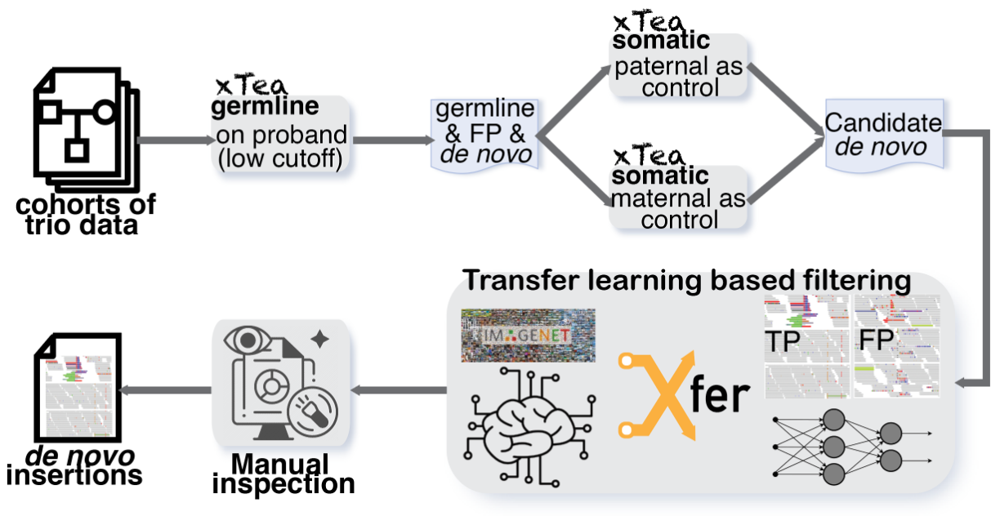

## xTea-trioML

xTea-trioML is an improved version of xTea designed to identify de novo TE insertions from trio whole-genome sequencing (WGS) data. 




## Download

1. short reads (Illumina)

	+ 1.1 latest version

	```
	git clone --single-branch --branch xTea-trioML https://github.com/parklab/xTea.git
	```

2. pre-processed repeat library used by xTea (this library is used for both short and long reads)  
	
	```
	wget https://github.com/parklab/xTea/raw/master/rep_lib_annotation.tar.gz
	```
	
3. gene annotation files are downloaded from GENCODE. Decompressed gff3 files are required.
	+ For GRCh38 (or hg38), gff3 files are downloaded and decompressed from https://www.gencodegenes.org/human/release_33.html ;
	+ For GRCh37 (or hg19), gff3 files are downloaded and decompressed from https://www.gencodegenes.org/human/release_33lift37.html ;
	+ For CHM13v2, gff3 files are downloaded from https://s3-us-west-2.amazonaws.com/human-pangenomics/T2T/CHM13/assemblies/annotation/chm13.draft_v2.0.gene_annotation.gff3;
	+ Or use the latest version

## Dependencies

1. bwa (version **0.7.17** or later, which requires the **-o** option), which can be downloaded from https://github.com/lh3/bwa.
2. samtools (version 1.0 or later), which can be downloaded from https://github.com/samtools.
3. minimap2 (for long reads only), which can be downloaded from https://github.com/lh3/minimap2.
4. wtdbg2 (for long reads only), which can be downloaded from https://github.com/ruanjue/wtdbg2.
5. Python 2.7+/3.6+
	+ For the following packages, only a conda-based installation in shown. You may also install these in other ways, such as pip. 
	+ pysam (https://github.com/pysam-developers/pysam, version 0.12 or later) is required.
		+ Install pysam:
			```
			conda config --add channels r
			conda config --add channels bioconda
			conda install pysam -y
			```
	+ sortedcontainers
		+ Install sortedcontainers
		`conda install sortedcontainers -y`

	+ numpy, scikit-learn, and pandas
		+ Install numpy, scikit-learn and pandas
		`conda install numpy scikit-learn=0.18.1 pandas -y`

	+ DF21 (this is used to replease scikit-learn, which is complained by several users for version incompatible)
		+ Install DF21
		`pip install deep-forest`

6. Note: bwa and samtools need to be added to the $PATH.


## Run xTea
1. **Input**
	+ A sample id file list, e.g. a file named `sample_id.txt` with content as follows (each line represents one unique sample id):
	
		```
		NA12878
		NA12877
		```
	
	+ A file of listed alignments:

		+ An Illumina bam/cram file (sorted and indexed) list, e.g. a file named `illumina_bam_list.txt` with content as follows (two columns separated by a space or tab: sample-id bam-path):

			```
			NA12878 /path/na12878_illumina_1_sorted.bam
			NA12877 /path/na12877_illumina_1_sorted.bam
			```
		
		+  A 10X bam/cram file (sorted and indexed, see [BarcodeMate](https://github.com/simoncchu/BarcodeMate) regarding barcode-based indicies) list, e.g. a file named `10X_bam_list.txt` with content as follows (three columns separated by a space or tab: sample-id bam-path barcode-index-bam-path):
		
			```
			NA12878 /path/na12878_10X_1_sorted.bam /path/na12878_10X_1_barcode_indexed.bam
			NA12877 /path/na12877_10X_1_sorted.bam /path/na12877_10X_1_barcode_indexed.bam
			```
		
		+  A case-ctrl bam/cram file list (three columns separated by a space or tab: sample-id case-bam-path ctrl-bam-path
			```
			DO0001 /path/DO001_case_sorted.bam /path/DO001_ctrl_sorted.bam
			DO0002 /path/DO002_case_sorted.bam /path/DO002_ctrl_sorted.bam
			```

2. **Run from the Cloud**
	
	+ A docker file and a cwl file are provided for running the tool on AWS/GCP/FireCloud.


			
3. **Output**

	A gVCF file will be generated for each sample.
	
